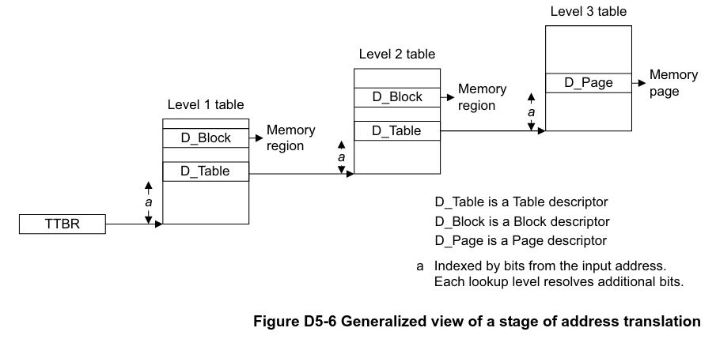

# ArmV8-A Architecture Notes - Virtual Memory System Architecture (VMSA)
**CPU:** Cortex-A72

[**Reference Manual**](https://developer.arm.com/documentation/ddi0487/fc/)

## Table of Contents
- [VMSA Address Types and Address Spaces](#vmsa-address-types-and-address-spacesVMSA)
  - [Virtual Address (VA)](#virtual-address-(va))
  - [Intermediate Physcial Address (IPA)](#Intermediate-physical-address-(ipa))
  - [Physcial Address (PA)](#physical-address-(pa))
- [VMSA Address Translation System](#vmsa-address-translation-system)
  - [AArch64 Translation Regimes](#aarch64-translation-regimes)
  - [Address Translation & Supported Input Address Ranges](#address-translation-%26-supported-input-address-ranges)
  - [VMSA Translation Table Format](#vmsa-translation-table-format)
  - [Controlling Address Translation Stages](#controlling-address-translation-stages)
  - [Address Size Configuration](#address-size-configuration)
  - [Translation Tables and Translation Process](#translation-tables-and-translation-process)
    - [Translation Table Walks](#translation-table-walks)

### VMSA Address Types and Address Spaces

#### Virtual Address (VA)
- Data, or instruction addresses are virtual addresses.
  - Addresses held in `PC`, `LR`, `SP`, `ELR` are virtual addresses.
- AArch64 has a **maximum** address width of 48 bits. This supports an address space
  of 256 terabytes.

#### Intermediate Physcial Address (IPA)
- Identical to physical address when translation regime only supports one stage
  of address translation.

#### Physcial Address (PA)
- Actual address of a location in physical memory.

### VMSA Address Translation System
- MMU controls the translation process, as well as handling access permissions for
  memory accesses. The MMU analyzes a certain access, gathering the **_input address_** (IA),
  and returns the **_output address_** and **_memory attributes_** for the address.
  - If the translation is unsuccessful, an exception denoted as an _MMU fault_ will be generated.
- **Translation Regime**: Process of mapping virtual addresses to physical addresses (address translation (AT)).
- **Translation Granule**: Specifies the granularity of IA to OA mappng, namely:
  - The _page size_ for a certain AT stage.
  - Size of a complete translation table for that stage of translation.
- The MMU is controlled by system registers, providing independent control of each address
  translation stage.
  - These registers additionally control the disabling of certain stages.
- Each _enabled_ stage of AT uses set of address translations and associated memory properties.
  These are held in m-mapped tables called **_translation tables_**. A single lookup can only
  correspond to a limited number of bits in the IA, so one AT might require more than 1 lookup.
  - The table entries are cached in the TLB.

#### AArch64 Translation Regimes
- **EL0 & EL1 Regime when EL2 is disabled**:
  - Single stage of translation, mapping VAs to PAs, supporting two VA ranges.
  - This is non-secure when `SCR_EL3.NS == 1`

#### Address Translation & Supported Input Address Ranges
- During a single stage of translation, the _translation table base register_, (`TTBR_ELx`)
  holds the start of the first table required for mapping the IA to the OA.
- A full table lookup is known as a _translation table walk_. This is done automatically
  by the hardware.

#### VMSA Translation Table Format
- Up to 4 levels of address lookups.
- Translation granule (page size) of 4, 16, or 64 kilobytes.
- Input and output addresses of up to 48 bits, 52 if `FEAT_LVA` is implemented.

#### Controlling Address Translation Stages
- System register bit `SCTLR_ELx.M` enables the stage of address translation.
- System register bit `SCTLR_ELx.EE` determines the endianness of lookups.
- A _translation control register_ (`TCR_ELx`) controls the stage of address translation.
- Regardless of one or 2 address ranges, there will always be a single `TCR_ELx`, and one
  `TTBR{0|1}_ELx` for each address range.
- See table **D5-2** for the exact registers used for each translation stage.

#### Address Size Configuration
- System register field `ID_AA64MMFR0_EL1.PARange` indicates the implemented physical address size:

| Bits | Total PA Size   | PA Address Size (Bits) |
|------|-----------------|------------------------|
| 0000 | 4   GB          | 32                     |
| 0001 | 64  GB          | 36                     |
| 0010 | 1   TB          | 40                     |
| 0011 | 4   TB          | 42                     |
| 0100 | 16  TB          | 44                     |
| 0101 | 256 TB          | 48                     |
| 0110 | 4   PB          | 52                     |

- For each enabled stage of translation, `TCR_ELx.{I}PS` holds the maximum output address size for
  that stage of the translation:

| Bits | Total OA Size   | OA Address Size (Bits) |
|------|-----------------|------------------------|
| 000  | 4   GB          | 32                     |
| 001  | 64  GB          | 36                     |
| 010  | 1   TB          | 40                     |
| 011  | 4   TB          | 42                     |
| 100  | 16  TB          | 44                     |
| 101  | 256 TB          | 48                     |
| 110  | 4   PB          | 52                     |

- Each enabled stage of translation, the fields of `TCR_ELx.TxSZ` determine the IA size
  - When 2 VA ranges are implemented, the size of the lower VA range is specified with
    `TCR_ELx.T0SZ`, and translated with `TTBR0_ELx`. Replace the `0` with a `1` for
    when dealing with the higher range.
  - For 1 VA range, `TCR_ELx.T0SZ`, translated with `TTBR0_ELx`.

#### Translation Tables and Translation Process

##### Translation Table Walks
- One or more translation lookups to translate the VA to the PA.
- Returns the PA, memory attributes, and acccess permissions for the region.
- Starts with read of translation table at `TTBR_ELx`. Each read here will
  return a descriptor that indicates either:
  - The final entry of the walk -> OA.
  - Additional level of lookup is required.
  - It is invalid -> translation fault.
- `TCR_ELx` determines the memory capability and shareability  attributes for the
  corresponding stage of translation.

#### Table Entry Descriptor Formats (See section D5.3 of the manual.)
